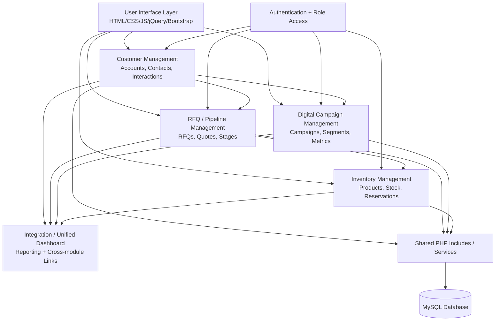

# Diagram 02 — Module Architecture

## Diagram type
Module architecture diagram / high-level component diagram.

## Purpose
Show the four student-owned modules and the shared integration/dashboard layer. This helps the group divide work while still showing how the modules connect.

## Source requirements translated
- Student 1 owns Customer Management.
- Student 2 owns RFQ / Pipeline Management.
- Student 3 owns Digital Campaign Management.
- Student 4 owns Inventory Management.
- All students share common infrastructure, framework, design, testing, implementation, deployment, and integration.
- The system uses a shared codebase and shared database.
- Internal APIs or shared PHP functions can support module communication.

## Elements / nodes
- User Interface Layer
- Customer Management Module
- RFQ / Pipeline Management Module
- Campaign Management Module
- Inventory Management Module
- Integration / Dashboard Module
- Authentication / Role Access
- Shared PHP Includes / Services
- MySQL Database

## Relationships / arrows
- User Interface Layer -> all four modules
- Authentication / Role Access -> all modules
- Customer Management -> RFQ / Pipeline: RFQs are linked to customers/accounts
- Customer Management -> Campaign Management: campaigns select customer segments/tags
- RFQ / Pipeline -> Inventory Management: RFQs reserve inventory
- All modules -> Integration / Dashboard: module data feeds dashboard/reporting
- All modules -> Shared PHP Includes / Services: common reusable business logic
- All modules -> MySQL Database: shared persistence layer

## Layout recommendation
Use a layered layout:
1. Top: User Interface Layer
2. Middle: four primary modules
3. Side or center: Integration / Dashboard
4. Bottom: Shared PHP Services and MySQL Database
5. Authentication as a vertical cross-cutting concern on the left

## Mermaid starter

## Draw.io notes
- Represent each module as a rounded rectangle.
- Use a database cylinder for MySQL.
- Use a vertical “Authentication / RBAC” bar touching every module.
- Show “Integration / Dashboard” as the module that consumes data from all others.
