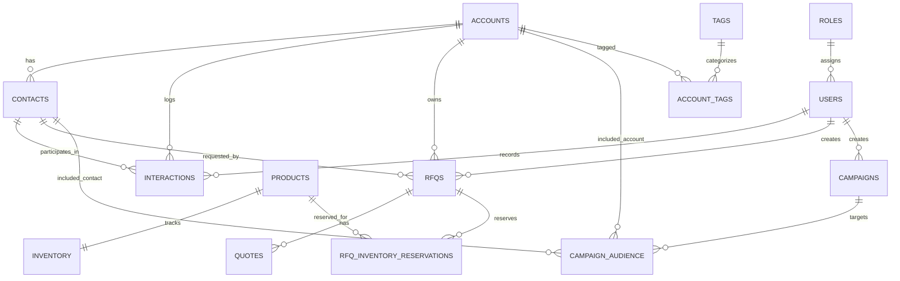

# Diagram 03 — ERD / Data Model

## Diagram type
Entity Relationship Diagram.

## Purpose
Define the shared MySQL database model used by all CRM modules.

## Source requirements translated
- Customers/accounts have company/contact information, tags, industry, and address fields.
- One account can have multiple contacts.
- Accounts can exist without contacts.
- Contacts should not exist without an account.
- RFQs are linked to customers/accounts.
- Quotes store amount, discount, and validity period.
- Campaigns are linked to customer segments, tags, or filters.
- Products have SKU, price, description, and stock information.
- Inventory can be reserved for RFQs.
- Users have roles for access control.

## Core entities and suggested fields

### users
- id PK
- name
- email UNIQUE
- password_hash
- role_id FK
- created_at
- updated_at

### roles
- id PK
- role_name UNIQUE
- description

### accounts
- id PK
- account_name
- parent_account_id FK nullable
- email nullable
- phone nullable
- address nullable
- industry nullable
- source nullable
- tags nullable or separate account_tags table
- created_at
- updated_at

### contacts
- id PK
- account_id FK required
- first_name
- last_name
- email
- phone
- title nullable
- source nullable
- notes nullable
- created_at
- updated_at

### interactions
- id PK
- account_id FK required
- contact_id FK nullable
- user_id FK required
- interaction_type enum: call, email, note, meeting
- interaction_date
- summary
- created_at

### rfqs
- id PK
- account_id FK required
- contact_id FK nullable
- created_by_user_id FK
- title
- description
- stage enum: New, In Review, Quoted, Negotiation, Won, Lost
- status_open_won_lost enum or derived from stage
- created_at
- updated_at

### quotes
- id PK
- rfq_id FK required
- quote_amount
- discount
- validity_start_date
- validity_end_date
- created_at

### products
- id PK
- product_name
- sku UNIQUE
- price
- description
- created_at
- updated_at

### inventory
- id PK
- product_id FK required
- available_quantity
- reserved_quantity
- updated_at

### rfq_inventory_reservations
- id PK
- rfq_id FK required
- product_id FK required
- quantity_reserved
- reservation_status enum: Reserved, Released, Converted
- created_at
- updated_at

### campaigns
- id PK
- campaign_name
- campaign_type enum: Email, SMS Simulation
- status enum: Draft, Scheduled, Sent, Completed
- created_by_user_id FK
- sent_count
- open_rate nullable
- click_rate nullable
- created_at
- updated_at

### campaign_audience
- id PK
- campaign_id FK required
- account_id FK nullable
- contact_id FK nullable
- tag_filter nullable
- segment_name nullable

### tags optional normalization
- id PK
- tag_name UNIQUE

### account_tags optional normalization
- account_id FK
- tag_id FK

## Key relationships
- roles 1 -> many users
- accounts 1 -> many contacts
- accounts 1 -> many interactions
- contacts 1 -> many interactions
- accounts 1 -> many rfqs
- contacts 1 -> many rfqs, optional
- users 1 -> many rfqs
- rfqs 1 -> many quotes
- products 1 -> 1 inventory
- rfqs many -> many products through rfq_inventory_reservations
- users 1 -> many campaigns
- campaigns many -> many accounts/contacts through campaign_audience
- accounts many -> many tags through account_tags, if normalized

## Important cardinality decisions
- Account to Contact: Account `0..many` Contacts. Contact `exactly 1` Account.
- Account to RFQ: Account `0..many` RFQs. RFQ `exactly 1` Account.
- RFQ to Quote: RFQ `0..many` Quotes.
- RFQ to Inventory Reservation: RFQ `0..many` Reservations.
- Product to Inventory: Product `0..1` or `1..1` Inventory row. Prefer `1..1` after product creation.

## Mermaid starter

## Draw.io notes
- Make `accounts`, `contacts`, `rfqs`, `products`, and `campaigns` the largest boxes.
- Use crow’s-foot notation.
- Keep optional entities like tags visually separate so the base ERD stays readable.
