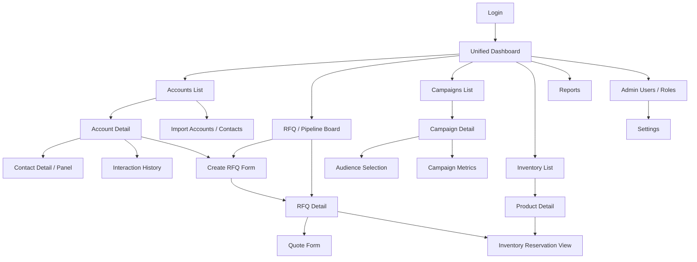

# Diagram 04 — Navigation and Wireframe Map

## Diagram type
Navigation map / screen flow / wireframe planning diagram.

## Purpose
Define the main screens and how users move through the CRM. This should guide wireframes and help each student know where their module fits in the UI.

## Source requirements translated
- The app should have simple navigation menus and responsive Bootstrap UI.
- Users access the CRM through a browser.
- Main modules are Customer, RFQ/Pipeline, Campaign, Inventory, and Dashboard.
- Admin needs user management and system configuration.

## Main screens
- Login
- Dashboard
- Accounts List
- Account Detail
- Contact Detail or Contact Panel
- Interaction History
- RFQ / Pipeline Board
- Create RFQ Form
- RFQ Detail
- Quote Detail / Quote Form
- Campaigns List
- Campaign Detail / Campaign Form
- Audience Selection
- Campaign Metrics
- Inventory List
- Product Detail
- Inventory Reservation View
- Reports
- Import Accounts / Contacts
- Admin Users / Roles
- Settings

## Navigation relationships
- Login -> Dashboard
- Dashboard -> Accounts
- Dashboard -> RFQ Pipeline
- Dashboard -> Campaigns
- Dashboard -> Inventory
- Dashboard -> Reports
- Accounts List -> Account Detail
- Accounts List -> Import Accounts / Contacts
- Account Detail -> Contact Detail
- Account Detail -> Interaction History
- Account Detail -> Create RFQ Form
- Create RFQ Form -> RFQ Detail
- RFQ Pipeline -> RFQ Detail
- RFQ Pipeline -> Create RFQ Form
- RFQ Detail -> Quote Form
- RFQ Detail -> Inventory Reservation View
- Campaigns List -> Campaign Detail
- Campaign Detail -> Audience Selection
- Campaign Detail -> Campaign Metrics
- Inventory List -> Product Detail
- Product Detail -> Inventory Reservation View
- Admin Users / Roles -> Settings

## Suggested wireframe regions
Each main page should share the same layout:
- Top navigation bar
- Left sidebar or module navigation
- Main content card/table area
- Search/filter row for list pages
- Detail panel for selected record
- Action buttons such as Add, Edit, Save, Delete, Reserve, Convert, Send

## Mermaid starter

## Draw.io notes
- Use screen-shaped rectangles.
- Group pages by module using colored swimlanes.
- Put Dashboard at the center/top since it is the hub.
