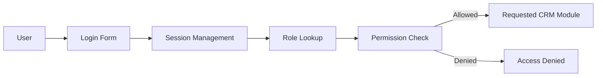

# Diagram 05 — Role Permission Matrix

## Diagram type
Role-permission matrix / access control diagram.

## Purpose
Translate the role-based access control requirement into a clear view of what each role can do.

## Source requirements translated
- Admin has full system access, user management, and system configuration.
- Sales User manages customers and creates/tracks RFQs.
- Marketing User manages campaigns and views campaign analytics.
- Inventory Manager manages products, stock, and inventory availability.
- Security requires password hashing, role-based access control, and session management.

## Roles
- Admin
- Sales User
- Marketing User
- Inventory Manager

## Permissions matrix

| Feature / Action | Admin | Sales User | Marketing User | Inventory Manager |
|---|---:|---:|---:|---:|
| Login / logout | Yes | Yes | Yes | Yes |
| View dashboard | Yes | Yes | Yes | Yes |
| Manage users and roles | Yes | No | No | No |
| System configuration | Yes | No | No | No |
| Create/edit accounts | Yes | Yes | View only | View only |
| Create/edit contacts | Yes | Yes | View only | View only |
| Add interaction history | Yes | Yes | Limited/View | No/View |
| Create RFQs | Yes | Yes | No | No/View |
| Update RFQ stages | Yes | Yes | No | No/View |
| Create/update quotes | Yes | Yes | No | No/View |
| Mark RFQ as won/lost | Yes | Yes | No | No/View |
| Create campaigns | Yes | No | Yes | No |
| Select campaign audience | Yes | No | Yes | No |
| View campaign metrics | Yes | No/View | Yes | No |
| Create/edit products | Yes | No | No | Yes |
| Update stock quantities | Yes | No | No | Yes |
| Reserve inventory for RFQ | Yes | Yes/Request | No | Yes/Approve |
| View reports | Yes | Yes | Yes | Yes |

## Visual layout recommendation
Use a grid with roles as columns and features as rows. Color cells by permission:
- Full access: green
- View only: yellow
- No access: red/gray
- Conditional/optional: blue or dashed outline

## Optional RBAC flow

## Draw.io notes
- A matrix is better than a normal flowchart here.
- Put RBAC flow beside the matrix only if there is room.
- This diagram helps prove that security is being handled intentionally.
