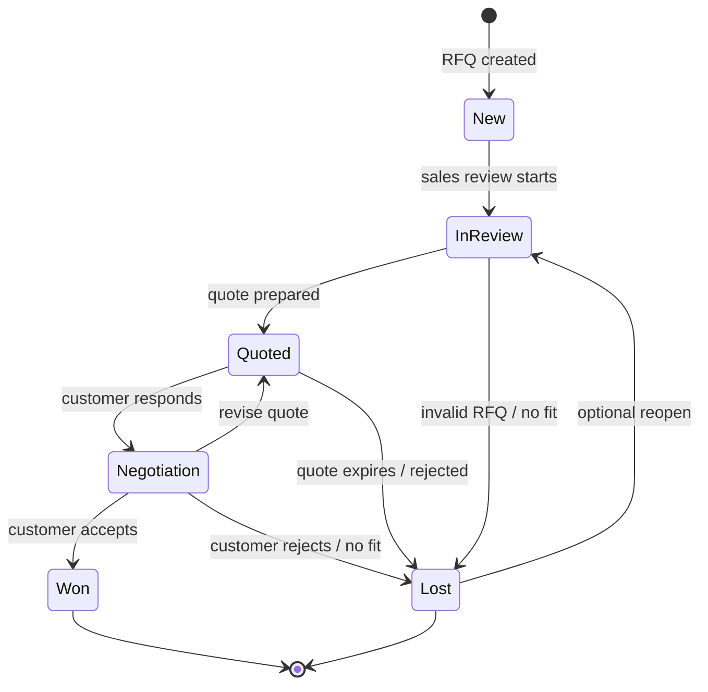

# Diagram 06 — RFQ Pipeline State Diagram

## Diagram type
State diagram.

## Purpose
Show how an RFQ moves through the sales pipeline from creation to final outcome.

## Source requirements translated
- RFQs must be created and linked to customers/accounts.
- RFQs move through the stages: New, In Review, Quoted, Negotiation, Won, Lost.
- Quote tracking stores quote amount, discount, and validity period.
- The system allows conversion of an RFQ into a Deal Won.
- Pipeline dashboard should consider multiple statuses such as Open, Won, and Lost.

## States
- New
- In Review
- Quoted
- Negotiation
- Won
- Lost

## Suggested higher-level status mapping
- Open: New, In Review, Quoted, Negotiation
- Won: Won
- Lost: Lost

## Transitions
- Create RFQ -> New
- Review RFQ -> In Review
- Prepare Quote -> Quoted
- Customer Responds / Follow-up -> Negotiation
- Customer Accepts -> Won
- Customer Rejects / No Fit / Expired -> Lost
- Requote / Revise Quote: Negotiation -> Quoted
- Reopen Lost RFQ: Lost -> In Review, optional

## Business rules
- Every RFQ should be linked to an account/customer.
- A quote should generally exist before moving to Quoted.
- Inventory reservations may begin when RFQ is In Review, Quoted, or Negotiation depending on business decision.
- Won should trigger final deal conversion and inventory commitment.
- Lost should trigger reservation release if inventory was reserved.

## Mermaid starter

## Draw.io notes
- Use rounded state nodes.
- Use green for Won and red/gray for Lost.
- Add a side legend explaining Open = New/In Review/Quoted/Negotiation.
