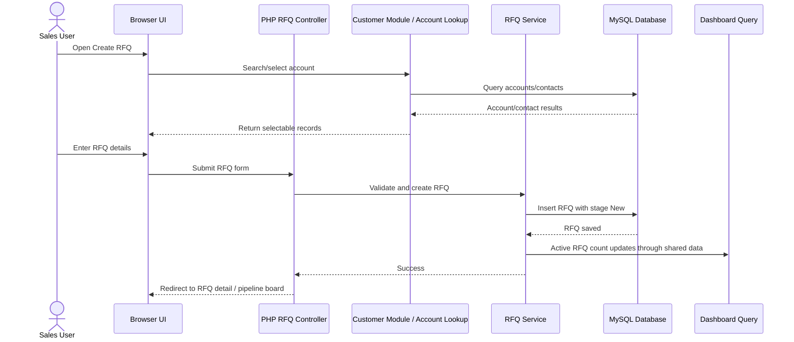

# Diagram 07 — RFQ Creation Sequence Diagram

## Diagram type
Sequence diagram.

## Purpose
Show the technical interaction when a Sales User creates an RFQ linked to an account/customer.

## Source requirements translated
- Sales User can manage customers and create/track RFQs.
- RFQs must be linked to customers/accounts.
- RFQ creation belongs to the RFQ/Pipeline module but depends on Customer Management.
- The system is a PHP/MySQL monolithic web app.
- Dashboard data should update from active RFQs.

## Actors / lifelines
- Sales User
- Browser UI
- PHP RFQ Controller / Page
- Customer Module / Account Lookup
- RFQ Service / Business Logic
- MySQL Database
- Dashboard / Reporting Query

## Sequence steps
1. Sales User opens “Create RFQ”.
2. Browser UI requests account/customer search.
3. PHP customer/account lookup queries MySQL.
4. User selects an account and optionally contact.
5. User enters RFQ title, description, and initial details.
6. Browser submits RFQ form.
7. PHP RFQ controller validates required fields.
8. RFQ service creates RFQ with stage `New`.
9. MySQL stores RFQ linked to account and optional contact.
10. Dashboard/reporting layer includes the new RFQ in active RFQ count.
11. Browser redirects to RFQ detail or pipeline board.

## Error paths
- Missing account -> reject form and show validation error.
- Account not found -> show error and prevent RFQ creation.
- Database insert fails -> log error and show user-safe error message.

## Mermaid starter

## Draw.io notes
- Use sequence diagram vertical lifelines.
- Keep validation and database failure notes as callout boxes, not full alternate flows unless required.
