# Diagram 08 — RFQ to Inventory Reservation Flow

## Diagram type
Activity diagram / cross-module workflow.

## Purpose
Show how RFQs connect to inventory and how available/reserved stock changes.

## Source requirements translated
- Inventory module manages products, stock, available quantity, and reserved quantity.
- RFQs can reserve inventory.
- RFQ -> Inventory linkage is required by cross-module integration.
- RFQ outcomes should affect reserved inventory.

## Actors / swimlanes
- Sales User
- RFQ / Pipeline Module
- Inventory Module
- MySQL Database
- Dashboard

## Main flow
1. Sales User opens an RFQ.
2. User selects product(s) to reserve.
3. System checks available quantity.
4. If enough stock exists, reservation is created.
5. Reserved quantity increases.
6. Available quantity decreases or is recalculated as total minus reserved.
7. RFQ detail shows reserved products.
8. Dashboard inventory status updates.
9. If RFQ becomes Won, reservation is converted/committed.
10. If RFQ becomes Lost, reservation is released.

## Decision points
- Is product found?
- Is requested quantity available?
- Did the RFQ become Won?
- Did the RFQ become Lost?

## Suggested reservation statuses
- Reserved
- Released
- Converted

## Mermaid starter

```mermaid
flowchart TD
    Start([Start: Open RFQ])
    Select[Select product and quantity]
    CheckProduct{Product exists?}
    CheckStock{Enough available stock?}
    CreateReservation[Create RFQ inventory reservation]
    UpdateStock[Increase reserved quantity
Update available quantity]
    ShowRFQ[Show reservation on RFQ detail]
    Dashboard[Update dashboard inventory status]
    Outcome{RFQ outcome?}
    Won[Convert reservation to committed/sold]
    Lost[Release reservation back to available stock]
    Open[Keep reservation active]
    Error1[Show product error]
    Error2[Show insufficient stock error]
    End([End])

    Start --> Select
    Select --> CheckProduct
    CheckProduct -->|No| Error1 --> End
    CheckProduct -->|Yes| CheckStock
    CheckStock -->|No| Error2 --> End
    CheckStock -->|Yes| CreateReservation
    CreateReservation --> UpdateStock
    UpdateStock --> ShowRFQ
    ShowRFQ --> Dashboard
    Dashboard --> Outcome
    Outcome -->|Won| Won --> End
    Outcome -->|Lost| Lost --> End
    Outcome -->|Still open| Open --> End
```

## Draw.io notes
- Use swimlanes if possible: RFQ Module, Inventory Module, Database, Dashboard.
- Use decision diamonds for stock checks and RFQ outcomes.
- Use green arrows for successful reserve/convert and gray/red arrows for release/error.
