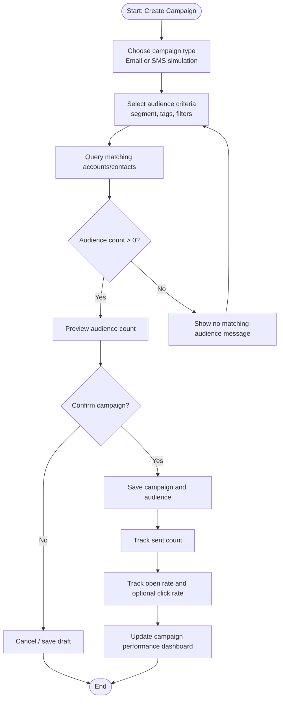

# Diagram 09 — Campaign Audience Selection Flow

## Diagram type
Activity diagram / marketing workflow.

## Purpose
Show how a Marketing User creates a campaign, chooses an audience, and tracks campaign metrics.

## Source requirements translated
- Campaigns can be email campaigns and optional simulated SMS campaigns.
- Campaigns link to customer segments, tags, and filters.
- Campaign tracking includes sent count, open rate, and optional click rate.
- Campaigns depend on customer/account/contact data.

## Actors / swimlanes
- Marketing User
- Campaign Module
- Customer Module
- MySQL Database
- Dashboard / Metrics

## Main flow
1. Marketing User creates a campaign.
2. User chooses campaign type: Email or SMS simulation.
3. User selects audience criteria: segment, tags, or filters.
4. Campaign module requests matching customers/contacts from Customer module/database.
5. System previews audience count.
6. User confirms campaign.
7. System stores campaign and audience selections.
8. Sent count is tracked.
9. Open rate and optional click rate are updated manually or simulated.
10. Dashboard shows campaign performance.

## Decision points
- Campaign type selected?
- Audience criteria valid?
- Audience count greater than zero?
- Is tracking simulated or manually entered?

## Mermaid starter

## Draw.io notes
- Use a database cylinder or customer module box beside the campaign flow.
- Show “tags/segments/filters” as inputs to audience selection.
- This diagram should prove that campaign management is integrated with customer data, not isolated.
