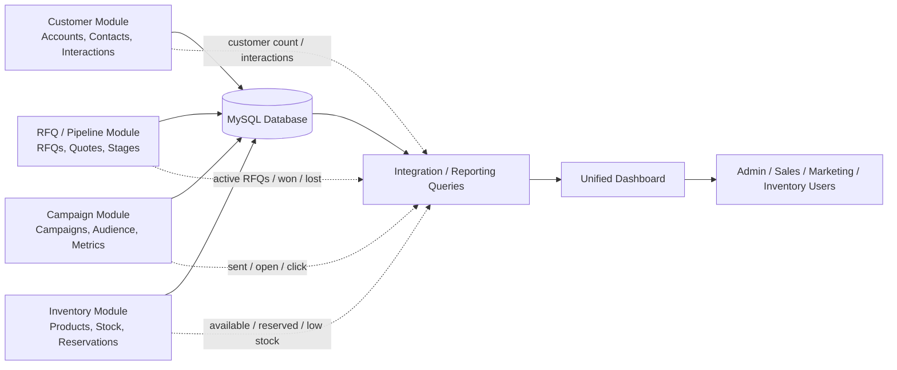

# Diagram 10 — Unified Dashboard Data Flow

## Diagram type
Data flow diagram.

## Purpose
Show how module data feeds the unified dashboard and reporting view.

## Source requirements translated
- Dashboard must show customer count, active RFQs, campaign performance, and inventory status.
- Integration layer must support cross-module data sharing.
- RFQ -> Customer linkage, Campaign -> Customer linkage, and RFQ -> Inventory linkage are required.
- Pipeline dashboard may rely on multiple data sources/statuses, including Open, Won, and Lost.

## Data sources
- Accounts / Contacts tables
- RFQs / Quotes tables
- Campaigns / Campaign Audience tables
- Products / Inventory / Reservations tables
- Users / Roles tables, if dashboard is role-sensitive

## Dashboard metrics
- Customer count
- Contact count
- Active RFQs
- RFQs by stage
- Won RFQs
- Lost RFQs
- Quote totals / pipeline value, optional
- Campaign sent count
- Campaign open rate
- Campaign click rate, optional
- Product count
- Low-stock products
- Reserved inventory count

## Data flows
- Customer Module -> Dashboard: account/contact counts, recent interactions
- RFQ Module -> Dashboard: active RFQs, stages, won/lost status, quote totals
- Campaign Module -> Dashboard: campaign counts, sent/open/click metrics
- Inventory Module -> Dashboard: available stock, reserved stock, low stock
- MySQL Database -> Dashboard Queries: aggregated metrics
- Dashboard -> Users: role-filtered operational summary

## Mermaid starter

## Draw.io notes
- Use data-flow arrows labeled with metrics.
- Put the dashboard on the far right as the final consumer.
- Put the database in the center to show that all modules share data.
