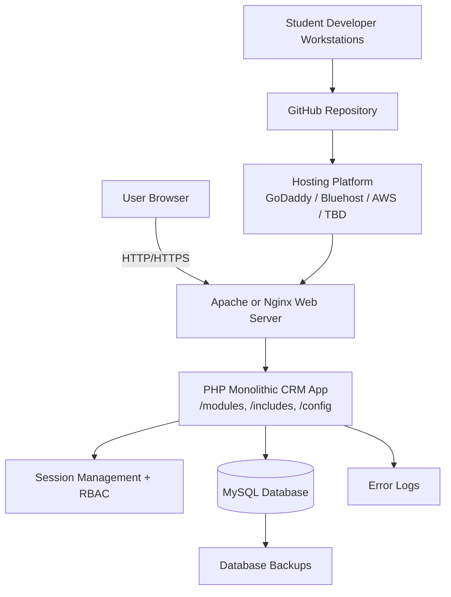

# Diagram 11 — Three-Tier Deployment Architecture

## Diagram type
Deployment diagram / 3-tier architecture diagram.

## Purpose
Show how the CRM is deployed and how browser, PHP application logic, and MySQL database interact.

## Source requirements translated
- The CRM is a monolithic web application.
- Frontend uses HTML5, CSS3, JavaScript, jQuery, and Bootstrap.
- Backend uses PHP.
- Database uses MySQL.
- Web server may be Apache or Nginx.
- Hosting may be GoDaddy, Bluehost, AWS, or another platform.
- Non-functional requirements include performance, security, maintainability, reliability, session management, backups, and error logging.

## Layers
1. Presentation Layer
   - Browser
   - HTML/CSS/JS/jQuery/Bootstrap
2. Application Layer
   - Apache or Nginx
   - PHP application
   - Modules folder
   - Includes/config
   - Authentication/session handling
3. Data Layer
   - MySQL database
   - Backups
   - Error logs

## Deployment nodes
- User Browser
- Hosting Platform
- Web Server: Apache/Nginx
- PHP Monolithic CRM App
- MySQL Database Server
- Backup Storage
- GitHub Repository
- Student Developer Workstations

## Relationships / arrows
- User Browser -> Web Server: HTTP/HTTPS requests
- Web Server -> PHP CRM App: routes requests to PHP pages/controllers
- PHP CRM App -> MySQL Database: SQL queries
- PHP CRM App -> Error Logs: logs runtime/database failures
- MySQL Database -> Backup Storage: scheduled/manual backups
- Student Developer Workstations -> GitHub: push code
- GitHub -> Hosting Platform: deployment process/manual upload/FTP depending on hosting

## Mermaid starter

## Draw.io notes
- Use three horizontal layers: Presentation, Application, Data.
- Place GitHub/developer deployment flow above or to the side.
- Use security callouts for password hashing, RBAC, and sessions.
