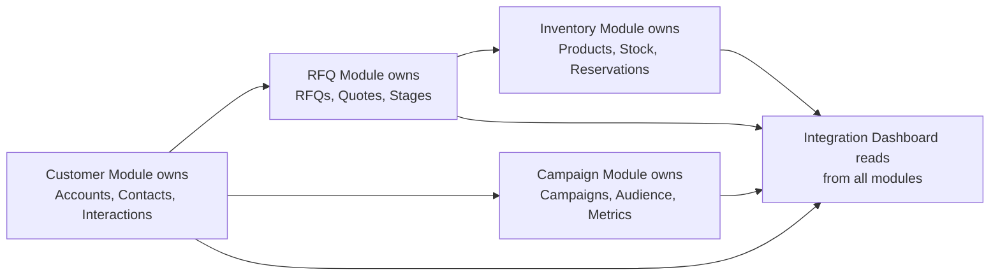

# Diagram 12 — CRUD Matrix

## Diagram type
CRUD matrix / module responsibility chart.

## Purpose
Show which module is responsible for creating, reading, updating, and deleting major entities. This helps divide work across the group and prevents duplicated logic.

## Source requirements translated
- Customer module owns customer profiles, contacts, and interaction history.
- RFQ/Pipeline module owns RFQs, stages, quotes, and deal conversion.
- Campaign module owns campaign creation, audience selection, and campaign tracking.
- Inventory module owns products, stock, and inventory allocation to RFQs.
- Integration layer supports cross-module sharing and reporting.

## CRUD matrix

| Entity | Customer Module | RFQ/Pipeline Module | Campaign Module | Inventory Module | Integration/Dashboard |
|---|---|---|---|---|---|
| Users | R | R | R | R | R |
| Roles | R | R | R | R | R |
| Accounts | C/R/U/D | R | R | R | R |
| Contacts | C/R/U/D | R | R | R | R |
| Interactions | C/R/U/D | R | R | R | R |
| RFQs | R | C/R/U/D | R | R | R |
| Pipeline stages | R | C/R/U | R | R | R |
| Quotes | R | C/R/U/D | No | R | R |
| Campaigns | R | No | C/R/U/D | No | R |
| Campaign audiences | R | No | C/R/U/D | No | R |
| Products | R | R | No | C/R/U/D | R |
| Inventory | R | R | No | C/R/U | R |
| RFQ inventory reservations | R | C/R/U | No | C/R/U | R |
| Dashboard metrics | R | R | R | R | C/R |

## Legend
- C = Create
- R = Read
- U = Update
- D = Delete
- No = no direct access/responsibility

## Visual layout recommendation
Use a table in draw.io with color-coded cells:
- Strong owner: dark fill
- Read/shared dependency: light fill
- No responsibility: gray

## Optional responsibility flow

## Draw.io notes
- This is most useful as a matrix, not a flowchart.
- It should be placed near the module architecture diagram in the final documentation.
